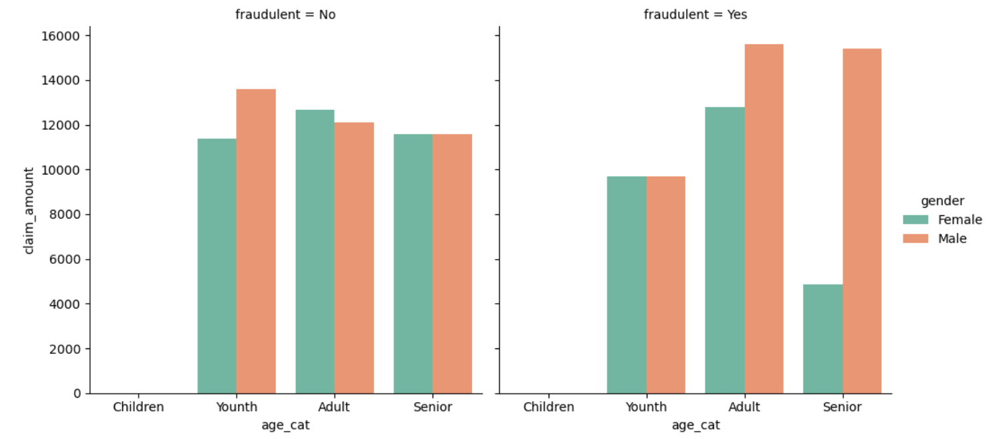
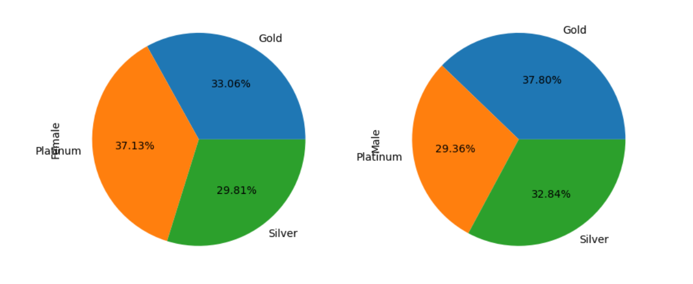
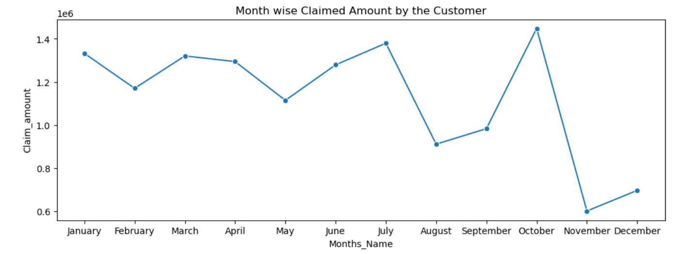
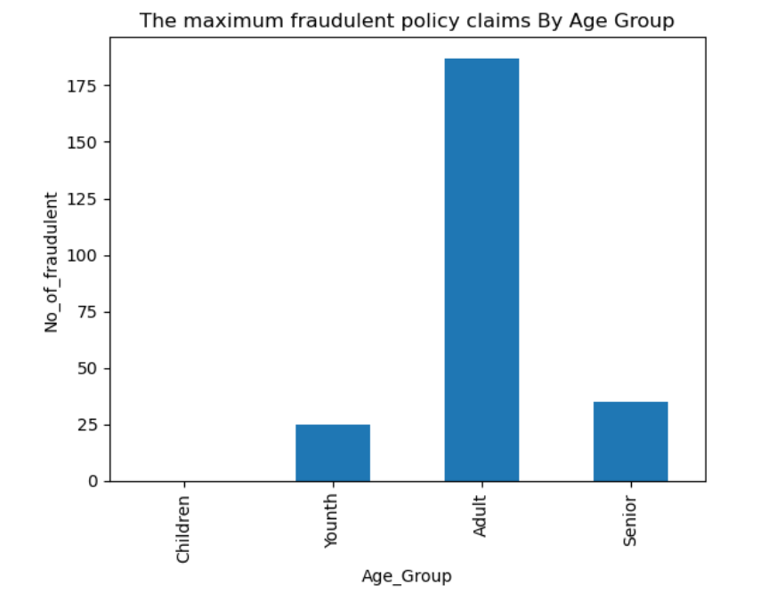

# 🏥 Insurance Claims Data Analysis

This project focuses on analyzing insurance claims data using Python to uncover insights related to customer behavior, fraud detection, claim amounts, and regional risk profiles.

---

## 📌 Project Objective

- Identify trends and patterns in insurance claims.
- Segment customers by age, gender, and region.
- Detect potential anomalies or fraudulent claims.
- Support data-driven decision making for underwriting and risk.

---

## 🛠️ Tools & Technologies Used

- **Python**: Core programming language
- **Pandas**: Data manipulation and transformation
- **Matplotlib & Seaborn**: Data visualization
- **Jupyter Notebook**: Interactive analysis

---

## 📂 Folder Structure

```
Insurance Claims Case Study/
├── insurance_case_study.ipynb # Main analysis notebook
├── claims.csv # Insurance claims data
├── cust_demographics.csv # Customer demographics data
├── customer_details.csv # Additional customer details
├── policy.csv # Insurance policy data
└── README.md # Project overview

```


---

## 🧪 Key Analytical Steps

- Data cleaning & merging across multiple sources
- Feature engineering (claim amount buckets, risk scores, etc.)
- Trend analysis by region, policy type, age group
- Visual exploration of fraud indicators

---

## 🚀 How to Run This Project

- Clone or download this repository.
- Open `insurance_case_study.ipynb` in **Jupyter Notebook**.
- Ensure all CSV files are in the same directory.
- Run each cell to perform data cleaning, merging, analysis, and plotting.

---

## 🧠 Key Insights

- Most claims are from customers aged **35–50**.
- **Southern and Western** regions report **higher average claim amounts**.
- Some customers filed claims **just after policy purchase**, indicating fraud suspicion.
- **Male customers** submitted more claims, but **female customers** had **higher average claim amounts**.

---

## 📌 Business Impact

- Helps identify **fraudulent behavior patterns** based on timing, region, and policy type.
- Supports **targeted underwriting policies** for risky geographies and customer profiles.
- Provides **actionable insights** for optimizing **claim approvals** and **audits**

---
## 📈 Sample Visuals

Include optional screenshots in your `images/` folder:









## 📌 Author

**Abhishek Bhardwaj** 
  
[LinkedIn](https://www.linkedin.com/in/abhishekbhardwaj28)
[GitHub](https://github.com/abhishek-9617)
